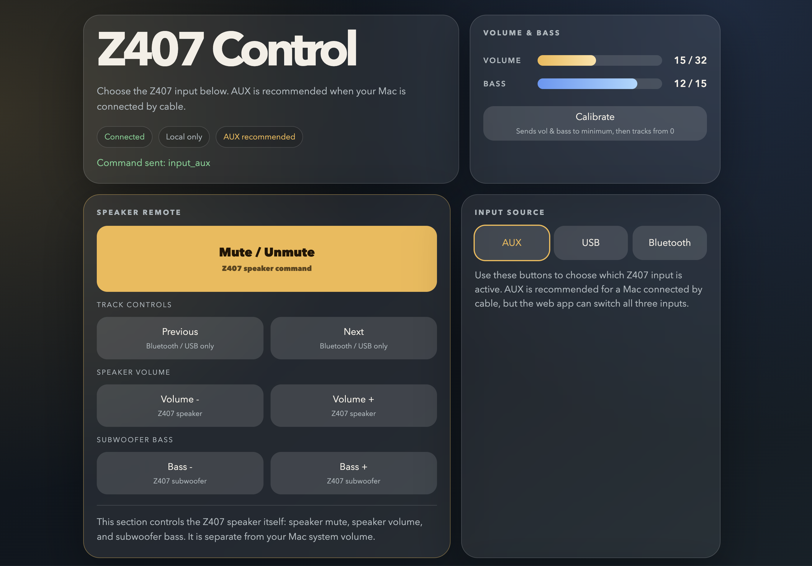

# Logitech Z407 Remote Control Web App for macOS

**A macOS-first web remote for Logitech Z407 speakers.**

[繁體中文 README](README.zh-TW.md)

If the original wireless control dial feels awkward, takes up desk space, or has already gone missing, this app can be useful. My own setup is simple: the Z407 stays connected to the Mac over AUX, the physical dial is usually put away, and normal volume changes are handled directly on the Mac. The inconvenience only shows up when I occasionally want to adjust bass or switch input sources without keeping the dial on the desk. This app is meant for that exact situation: you usually do not need the dial, but you still have quick access to the controls it provides.

The app runs a local web server on your Mac and mimics the original wireless control dial. It controls the Logitech Z407 over Bluetooth Low Energy (BLE). It is optimized for a common Mac setup where audio stays on a 3.5mm AUX cable and BLE is only used for remote-control commands.

## Features

- Full Z407 speaker control: mute, volume, bass, input switching (AUX / USB / Bluetooth), Bluetooth pairing, and factory reset
- Real-time volume and bass display: step counters sync on every confirmed BLE response (volume: 32 steps, bass: 15 steps) — use Calibrate to zero both and keep the display accurate
- Persistent state: volume and bass levels survive app restarts — calibrate once and it stays correct
- macOS menu bar icon: close the browser tab and the server keeps running quietly in the background; reopen the UI from the menu bar any time
- Control from your phone: enable LAN mode to open the same web UI from a phone on the same Wi-Fi
- Mac media controls: play/pause, previous/next, volume, and mute all from the same web interface
- Runs entirely on your Mac — no internet access required, no data leaves your machine
- Responsive UI that works on both desktop and phone browsers

## Screenshots



## Quick Start

### Mac App

Download `Logitech Z407 Remote Control.app` from the [Releases page](../../releases), unzip, and open it. You can drag it to your **Applications** folder for easy access.

macOS may show a security prompt on first launch — right-click the app and choose **Open**.

The app places an icon in the macOS menu bar. Click it to reopen the browser UI or quit the app.

### Terminal

```bash
chmod +x run_macos.sh
./run_macos.sh
```

Then open `http://127.0.0.1:8765` in your browser. `run_macos.sh` creates a virtual environment if needed, installs dependencies, and starts the server.

### Build from Source

```bash
./build_macos_app.sh
```

The packaged app will be at `release/Logitech Z407 Remote Control.app`.

## Recommended Setup

Connect your Mac to the Z407 using a 3.5mm AUX cable. AUX usually sounds better than Bluetooth and avoids distortion at higher volumes.

## Safer Exit

Click **Quit** in the web UI, or click the menu bar icon and choose **Quit**. Either method closes the app cleanly.

If running from Terminal, press `Ctrl+C`. Avoid `Ctrl+Z` — it suspends the process instead of closing it.

If the app cannot reconnect to the Z407 after a restart, try unplugging the speaker power for a few seconds. This clears stale Bluetooth state on the speaker side.

## Phone Control

To expose the app on your local network:

```bash
./run_macos.sh --lan
```

The app will print a LAN URL such as:

```text
http://192.168.1.35:8765
```

Open that address from a phone on the same Wi-Fi network.

> **Note:** LAN mode has not been personally tested in all environments. It may require adjusting your Mac's firewall settings to allow incoming connections on port 8765.

## macOS Permissions

macOS may ask for:

- **Bluetooth permission** for Terminal, Python, or a packaged app
- **Accessibility permission** when you use the Mac Media Controls buttons

If Mac Media Controls do not work, check **System Settings > Privacy & Security**.

## Advanced Usage

Examples:

```bash
./run_macos.sh --port 9090
./run_macos.sh --lan --port 9090
./run_macos.sh --preferred-input aux
./run_macos.sh --verbose
./run_macos.sh --debug-scan --duration 8
```

Defaults:

- Host: `127.0.0.1`
- Port: `8765`
- Preferred input: `aux`
- Logs: quiet by default

If discovery fails, use:

```bash
./run_macos.sh --debug-scan --duration 10 --rounds 3 --pause 3
```

That command lists BLE devices visible to macOS and highlights likely Z407 candidates.

## Build From Source

Runtime requirements:

- Python 3.12+
- `pip`
- `venv`

Run from source:

```bash
python3 -m venv venv
source venv/bin/activate
python -m pip install -r requirements.txt
python app.py
```

Development tools:

```bash
python -m pip install -r requirements-dev.txt
pytest -q
```

## Credits & Acknowledgments

**macOS Version:**
macOS adaptation, current maintenance, and this macOS-first version by **LCY000**. This version was developed from the original Linux web app into a macOS-focused app.

**Original Linux Web App:**
Original implementation by **Androrama**.

**Reverse Engineering:**
Special thanks to **freundTech** for the reverse engineering work that made this possible.
https://github.com/freundTech/logi-z407-reverse-engineering

**Upstream Project:**
This version was adapted from `Androrama/Logitech-Z407-Remote-Control-Web-App---Linux`.

## Disclaimer

This is an **unofficial** project and is not affiliated with, endorsed by, or connected to Logitech in any way.
"Logitech" is a trademark of its respective owner. This software is provided "as is" without warranty of any kind.

## Donations & Support

This project is 100% free. Using it, sharing it, and keeping attribution intact already helps.

If you find it useful, consider supporting **LCY000** (the macOS maintainer) — any support helps dedicate more time to this project and future improvements.

[](https://ko-fi.com/cyouuu)
